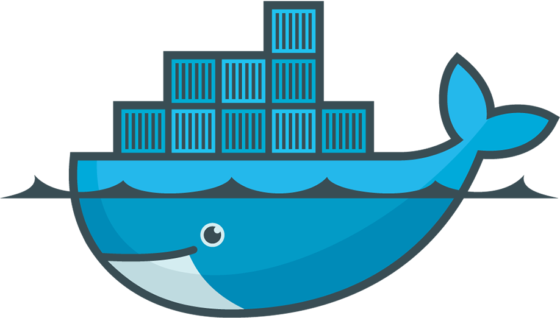
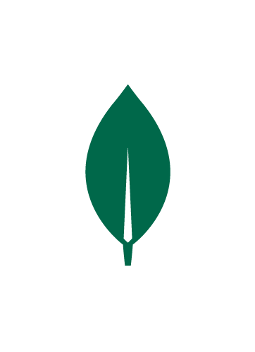

 &nbsp; &nbsp; &nbsp; &nbsp; &nbsp; &nbsp; 
 

---

### Hi, I'm Ismail - thanks for checking out my profile!

- I'm currently working on [fastai's Deep Learning course](https://github.com/ismailmo1/fastbook). Check out my [huggingface account](https://huggingface.co/ismailmo1) where i'll initially be deploying some smaller projects.

### About Me

- 🎓 My education was in chemical engineering 🧪
- 👔 My first jobs were in manufacturing :factory:
- 🤖 I first learnt to code automating tasks with excel VBA, I then discovered python and it spiralled out of control from there!
- 🛠️ I enjoy building things - it's mostly web focussed now as it's more fun when it's easier to share

<b>💻 Technologies</b>

&nbsp;

Find the full list of courses i've taken [here](https://github.com/ismailmo1/courses)

&nbsp;

Languages I'm comfortable with:

 &nbsp;
&nbsp; &nbsp;

Tools:

 &nbsp;
 &nbsp;
&nbsp;

Data technologies:

 
 
 

Web technologies:

 &nbsp;
 &nbsp;
&nbsp;
 &nbsp;

I'm learning:

 &nbsp;
 &nbsp;

...and i'm always keen to learn more!

&nbsp;

<b>🗂️ Key Projects</b>

&nbsp;

learn how I host all of these websites [here](https://github.com/ismailmo1/linode-config)

<h3>🥧 Formpy</h3>
A platform to create multiple choice forms and analyse the scanned responses with optical mark recognition.

[repository](https://github.com/ismailmo1/formpy-app) || [live website](https://formpy.ismailmo.com).

<h3>🌯 Myfitnesspal Wrapped</h3>
Inspired by Spotify's wrapped campaign: a data app that scrapes and analyses your food diary data from myfitnesspal.

[repository](https://github.com/ismailmo1/mfp-wrapped) || [live website](https://wrapped.ismailmo.com/).

<h3>⚽ Champions League Draw Simulator</h3>
A web app to simulate the champions league round of 16 draw.

[repository](https://github.com/ismailmo1/ucl-draw) || [live website](ucl-draw.web.app/).

<h3>🏕️ YelpCamp</h3>
A website to review campgrounds - like Yelp but for campgrounds.

[repository](https://github.com/ismailmo1/yelpcamp) || [live website](https://yelpcamp.ismailmo.com).

<h3>⚗️ ChemXL</h3>

An Excel add-in to retrieve chemical information - based on the [ChemSpider API](https://developer.rsc.org/)

[repository](https://github.com/ismailmo1/chemspider-xl) || [demo](https://drive.google.com/file/d/177IXOd4VUMphvt2_oDGPFrTLad4iVEab/view?usp=sharing)

